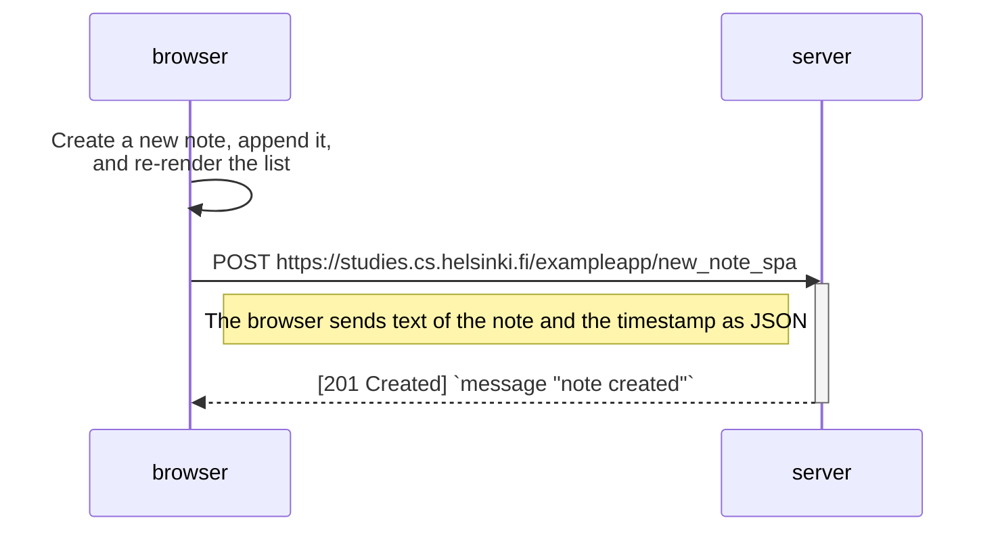

```mermaid
    sequenceDiagram
    participant browser
    participant server

    browser->>browser: Create a new note, append it,<br/>and re-render the list
    browser->>server: POST https://studies.cs.helsinki.fi/exampleapp/new_note_spa
    activate server
    Note right of browser: The browser sends text of the note and the timestamp as JSON
    server-->>browser: [201 Created] `message	"note created"`
    deactivate server
```
